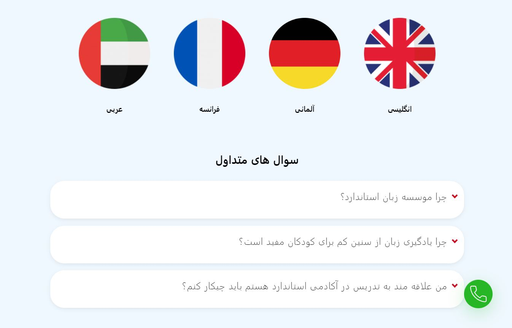

<h1 align="center">About Me</h1>

 Servus! I'm a full-stack web developer with a profound passion for creation.

Currently I am pursuing my second undergrad degree and work on various full-stack projects. I'm always improving my <a href="http://www.farbodmatin.ir"> Website </a>even tho my attention is more on my projects. at the time Im working on an exciting Project impacting my small town community named <a href="http://www.deggenhub.de">Dggenhub</a>. further exciting commits will follow!

  

  

    
    
  
  

A full-stack app for the community of Deggendorf

  <a href="https://deggenhub.de" target="_blank">Live Website</a>

  

  

  

  
  

  

Static app with Bootstrap for a client

 

  <a href="https://standard-academy.ir" target="_blank">Live Website</a>

  
  What is Lorem Ipsum?
Lorem Ipsum is simply dummy text of the printing and typesetting industry. Lorem Ipsum has been the industry's standard dummy text ever since the 1500s, when an unknown printer took a galley of type and scrambled it to make a type specimen book. It has survived not only five centuries, but also the leap into electronic typesetting, remaining essentially unchanged. It was popularised in the 1960s with the release of Letraset sheets containing Lorem Ipsum passages, and more recently with desktop publishing software like Aldus PageMaker including versions of Lorem Ipsum.
  <a href="https://farbodmatin.ir">Live Website</a>

<h1 align="center">Technologies I Have Used</h1>

  <h2>Languages and Tools<h2>
  
  
  
  
  
  
  
  

<h2>Frontend<h2>

    
<h2>Backend and Databases<h2>
  
  
  
  
  
  

<h1 align="center">Technologies I am Learning</h1>

  
  
  
  

