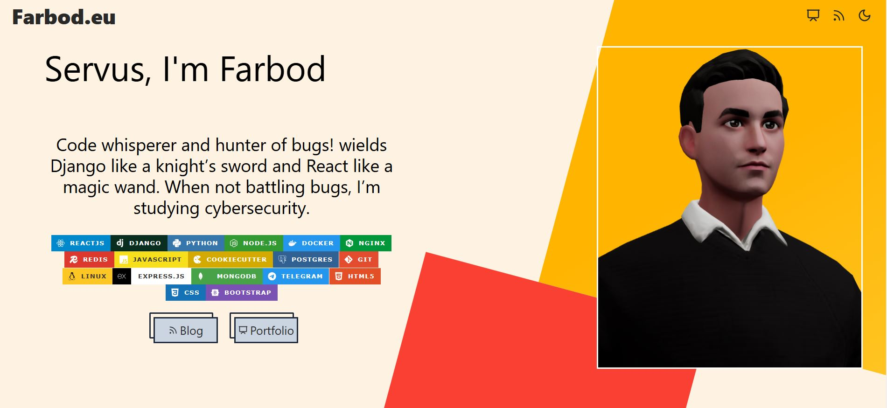
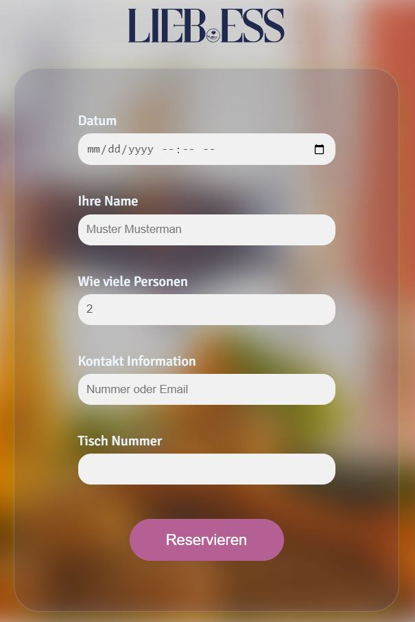
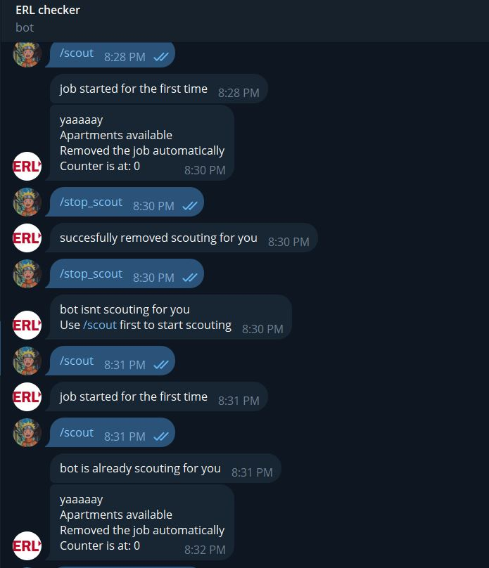

<h1 align="center">About Me</h1>

 Servus! I'm a full-stack web developer with a profound passion for creation.

Currently I am pursuing my second undergrad degree and work on various full-stack projects. I'm always improving<a href="http://www.farbod.eu">My Website </a>even tho my attention is more on my projects. at the time Im working on an exciting Project impacting my small town community named <a href="http://www.deggenhub.de">Dggenhub</a>. further exciting commits will follow!

<!-- seperator -->

  

<strong>Deggenhub</strong>

  

    
    
  
  

A full-stack app for the community of Deggendorf with live Weather! 
<strong>Technologies:</strong>The app uses a wide range of technologies. On the backend it makes API calls, has custom user authentication, retrieves information from databases, caches them and much more!

  <a href="https://deggenhub.de" target="_blank">Website is temporarily down for maintenance</a>

<!-- seperator -->

  

  

<strong>Personal Website</strong>

  

  

A React app made for fun! 
<strong>Technologies:</strong>Its a react app hosted on netlify making API calls to endpoints hosted on cloudfare workers!

  <a href="https://farbod.eu" target="_blank">Live Website</a>

<!-- seperator -->

  

  

<strong>SAAS basics</strong>

  

  

this is a playground for building prototype components needed for a SAAS app 
<strong>Technologies:</strong>React with framer motion and some other minor libraries.

  <a href="#" target="_blank">Visit</a> 
  <a href="https://github.com/farbod271/SAAS-components" target="_blank">Github Repo</a>

<!-- seperator -->

  

  

<strong>Cyber security Repo</strong>

  

  

usefull tips and tricks i learn in bug bounty and from portswigger or hack the box are here!

  <a href="https://github.com/farbod271/Cybersecurity" target="_blank">Github Repo</a>

<!-- seperator -->

  

  

<strong>Cyber security Repo</strong>

  

  

usefull tips and tricks i learn in bug bounty and from portswigger or hack the box are here!

  <a href="https://github.com/farbod271/Cybersecurity" target="_blank">Github Repo</a>

<!-- seperator -->

  

  
    
<strong>Liebess</strong>

  

  

  

<strong>Liebess Reservation system:</strong>An app for a client that lets you choose and reserve a table 
<strong>Technologies:</strong>A user can submit a form and choose the table from the custom built svg map of the actuall resturant. later versions will use react and the user will get a unique code to change the reservation details

  <a href=https://github.com/farbod271/liebess>Live version coming soon</a>

 

<!-- seperator -->

  
    
<strong>ERL Apartment Checker Bot</strong>

  

    
    

  

<strong>ERL-Checker</strong>: A Telegram Scraper Bot with subscription functionality that lets you know if any appartments in ERL deggendorf are availble 
<strong>Tech:</strong>the bot was created to solve a personal problem. this version has an engine that can check the availbility of apartments and a very basic database that users can subscribe. bot checks the site every 90 seconds and if anything is availble they will get a message from the bot.

  <a href="https://t.me/erlcheckerbot">Live Bot</a>

<!-- seperator -->

  

  

<strong>Leetcode Repo</strong>

  

  

Sometimes to practice my data and algo skills i do leetocde challenges and ill write what i learned and the code with which i solved the challenge here

  <a href="https://github.com/farbod271/leetcode" target="_blank">Github Repo</a>

<!-- seperator -->

  
    
<strong>Standard Academy</strong>

  

  
  

  

Static app with Bootstrap for a client

 

  <a href="https://standard-academy.ir" target="_blank">Live Website</a>

  <!-- seperator -->

<h1 align="center">Technologies I Have Used</h1>

  <h2>Languages and Tools<h2>
  
  
  
  
  
  
  
  

<h2>Frontend<h2>

    

<h2>Backend and Databases<h2>
  
  
  
  
  
  

<h1 align="center">Technologies I am Learning</h1>

  
  
  
  

